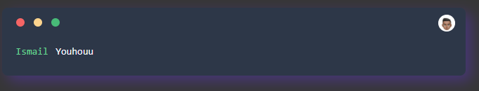

# vue-animated-terminal
VueJS Terminal with animated text

## Install
```shell
npm install --save vue-animated-terminal
```

## Usage
Just import the `Terminal` component where you want to see it !

```html
<template>
    <Terminal username="Ismail" :texts="['My first animated text', 'Youhouu !']" profilePicture="/resources/images/profile.png" typingSpeed="200" />
</template>

<script>
	import Terminal from 'vue-animated-terminal'

	export default {
		components: {
			Terminal
		}
	}
</script>
```

### Props
**- username**
The username displayed on left (string)

**- texts**
Texts to animate (array of strings)

**- profilePicture** (optional)
Path to the profile picture shown on the top right corner (string)

**- typingSpeed** (optional)
Speed of the text typing animation (milliseconds)
Default value: 200ms

## Screenshot

